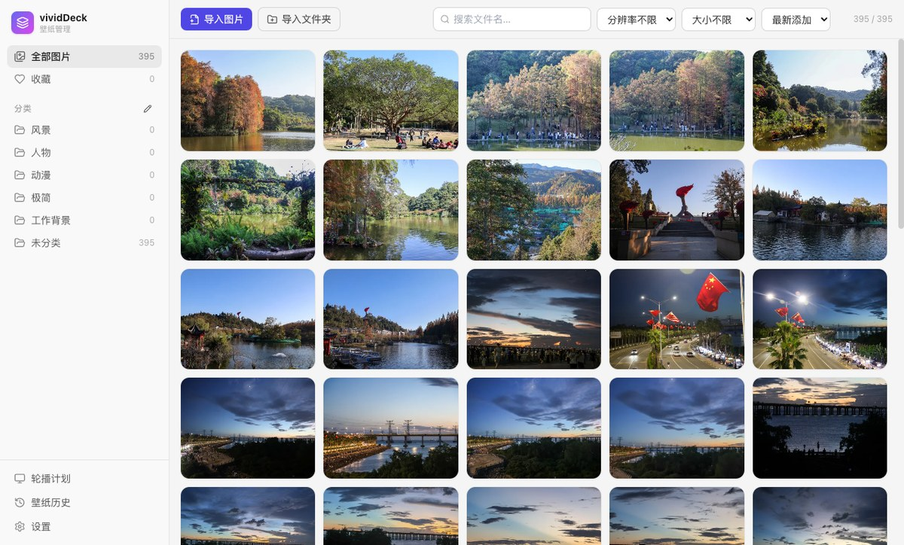
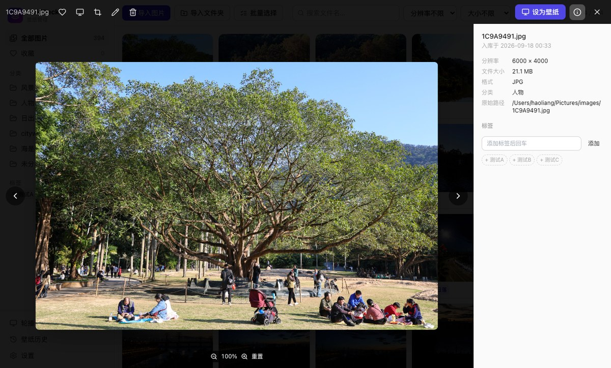
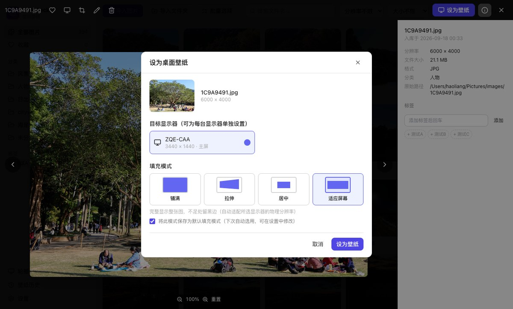
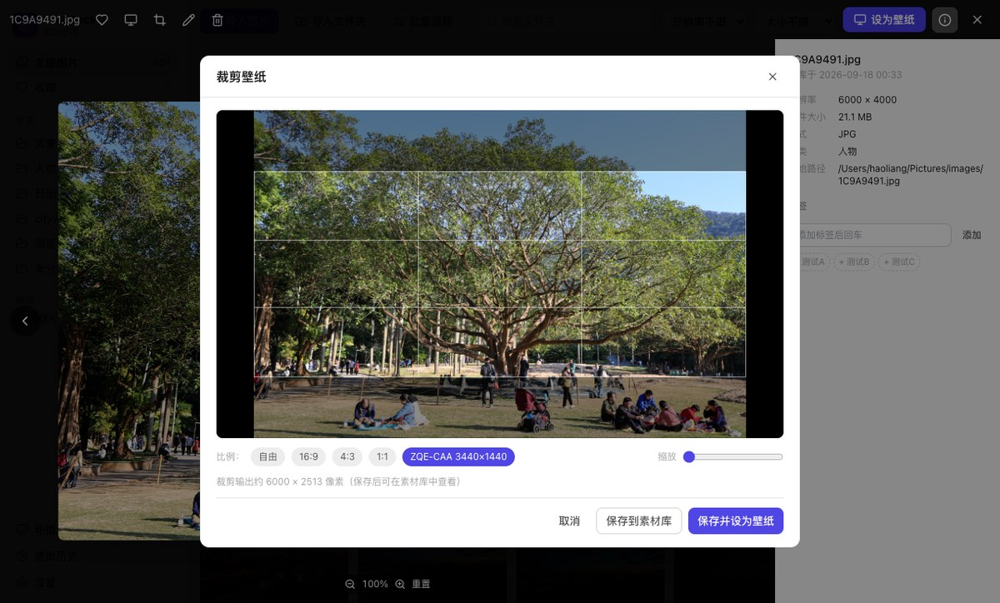
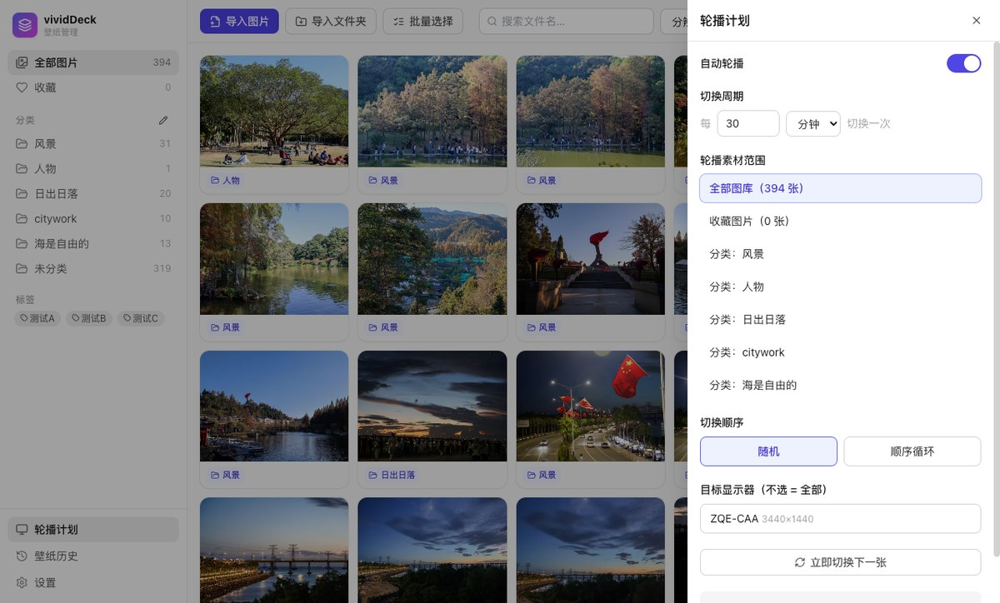
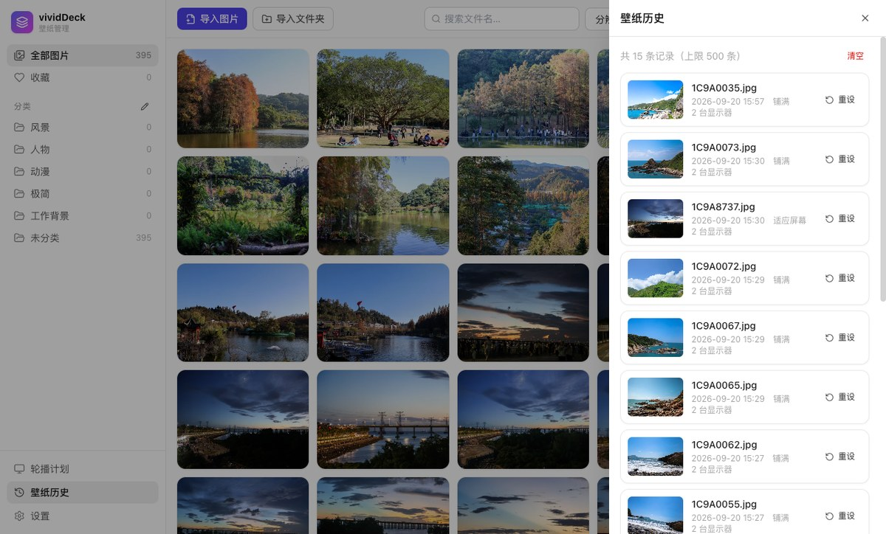
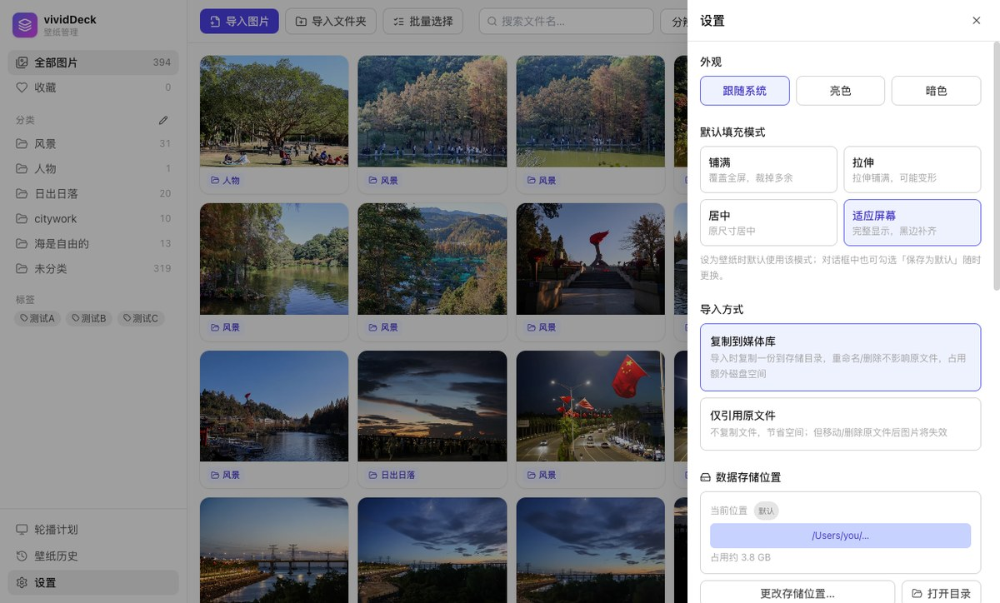

# vividDeck — 跨平台桌面壁纸管理应用

一套代码同时支持 **Windows 10/11** 与 **macOS（Ventura / Sonoma 及以上）** 的本地壁纸管理工具，数据全部本地存储、不上云。

## 功能截图

| 画廊与筛选 | 灯箱预览（缩放 / 信息面板 / 标签） |
|:---:|:---:|
|  |  |

| 一键设壁纸（多显示器 + 填充模式） | 壁纸裁剪（按屏幕比例 / 自由） |
|:---:|:---:|
|  |  |

| 轮播计划 | 壁纸历史（一键回溯） |
|:---:|:---:|
|  |  |

| 设置（主题 / 默认填充 / 存储位置 / MinIO 同步） | 桌面悬浮球（单击换壁纸） |
|:---:|:---:|
|  |  |

> 截图由 `scripts/capture-screenshots.mjs` 基于真实界面自动采集，可在换新 UI 后重跑更新。

## 功能总览

### 素材库管理
- **导入**：文件 / 文件夹批量导入、窗口拖拽导入；支持 JPG / PNG / WebP / HEIC（内置解码，不依赖系统编解码器）；按内容哈希自动去重
- **分类 / 标签 / 收藏**：预置 5 个分类可增删改；图片卡片可拖拽到侧栏分类归类；多标签系统；一键收藏
- **筛选检索**：分类 / 收藏 / 标签 / 分辨率（1080P·2K·4K）/ 文件大小 / 文件名关键词，多条件叠加
- **素材操作**：灯箱放大预览（滚轮缩放·平移）、**右键菜单**（设为壁纸 / 收藏 / 裁剪 / 重命名 / 删除 / 归类）、删除进系统废纸篓、图片信息面板（分辨率·大小·格式·路径·入库时间）
- **卡片信息栏**：缩略图下方直接展示所属分类与标签（超出折叠 +N）
- **批量操作**：批量选择模式下多选 → 批量设置分类 / 批量删除（全选当前筛选、Esc 退出、时间戳统一同步）
- **性能**：缩略图（WebP）与预览图（JPEG）按需生成 + 磁盘缓存，大图轻量化不占内存；画廊懒分页，数千张流畅

### 壁纸设置（双平台差异化适配）
- **一键设壁纸**：卡片双击 / 悬停按钮 / 右键菜单 / 灯箱按钮，四种入口
- **填充模式**：铺满 / 拉伸 / 居中 / 适应屏幕，**支持设置默认填充模式**（对话框"记住为默认"勾选 + 设置页修改），不必每次选择
- **多显示器**：识别每台显示器物理分辨率与 DPI 缩放，可为每台显示器单独设置，各自预渲染精确吻合
- **轮播计划**：分钟/小时/天周期，范围可选全部/分类/收藏，随机（洗牌防重复）或顺序循环（进度持久化重启续播）；**多显示器独立轮播**（默认开启，各屏各自切换不同照片、独立进度/队列，同轮去重；可关闭改为全屏同图）；关窗驻留系统托盘不中断，托盘菜单"下一张 / 打开 / 退出"
- **壁纸历史**：最近 500 条记录（含轮播切换），时间线展示，一键回溯复用
- **桌面悬浮球**：置顶圆形悬浮球显示当前壁纸缩略图，单击切换下一张、拖动换位（位置记忆·分辨率自适应）、右键菜单；托盘/设置可开关

### 进阶功能（v1.4）
- **操作可恢复**：批量分类/标签/删除支持撤销（Toast 按钮 + Cmd/Ctrl+Z，8 秒窗口）；删除区分「所有设备删除」与「仅清理本地副本」双入口；删除文件先进本地暂存区，退出才送废纸篓
- **智能相册**：保存组合筛选（标签交并集/横竖图/宽高比/分类/收藏/分辨率），随库同步，轮播可直接使用
- **每屏独立轮播**：每块显示器独立的范围/周期/填充/暂停，当前壁纸与下次切换倒计时展示，云端图后台预取
- **同步体检**：三方对账（云端孤儿/缺失原图/本地断链/缩略图）+ 修复动作 + 完整性哈希校验 + 下载取消与容量预估
- **大图库体验**：零依赖手写虚拟滚动（数千张仅渲染可见行）、搜索防抖、选中批量下载原图

### 辅助功能
- **裁剪工具**：自由比例 / 16:9 / 4:3 / 1:1 / 显示器原生比例，取景基于预览图、裁切在原图执行（无损画质），可保存后直接设为壁纸
- **数据本地持久化 + 存储位置可更换**：全部数据默认在 `用户数据目录/vividDeck/storage/`，支持一键整体迁移到其他磁盘 / 外置硬盘（先复制后切换，中断不丢数据；外置盘未挂载时启动有保护提示）
- **暗色 / 亮色主题**：跟随系统自动切换，也可手动固定

### 多设备同步（MinIO / S3，二期）
- 连接自建 MinIO / S3 对象存储，多台电脑共享壁纸库：元数据（分类/标签/收藏）全量双向同步
- 图片文件按需下载（查看/设壁纸/轮播时自动拉取并缓存），支持"全部下载/下载收藏"离线准备；缩略图全量同步保证新设备画廊秒开
- 冲突自动合并：记录级 LWW（最后修改者胜）+ 跨设备同图去重（收藏取或、标签并集）；删除以墓碑传播（90 天自动清理）
- 每设备独立清单快照（CRDT 合并，并发安全），旧快照自动压缩；SecretKey 经系统密钥链加密存储
- 自动同步（启动 + 变更后 30s 防抖）与手动同步（设置页 / 托盘菜单）

## 技术栈

| 层 | 技术 |
|---|---|
| 桌面框架 | Electron 33 + electron-vite（主进程 / preload 输出 ESM） |
| 界面 | React 18 + TypeScript + Tailwind CSS + Zustand |
| 图像处理 | sharp（HEIC 解码 / 缩略图 / 压缩 / 裁剪 / 填充模式预渲染） |
| 壁纸设置 | macOS：[wallpaper](https://github.com/sindresorhus/wallpaper) 库（osascript 后备自动降级）；Windows：自研 PowerShell + `IDesktopWallpaper` COM 接口（SystemParametersInfo 兜底） |
| 对象存储 | minio-js（多设备同步，S3 兼容） |
| 打包 | electron-builder（NSIS exe / dmg） |

双平台壁纸设置的差异化逻辑集中在：
`src/main/services/wallpaper/darwin.ts`（macOS）、`darwin-fallback.ts`（osascript 后备）、`win32.ts`（Windows），均以 `【系统适配 - xxx】` 注释块醒目标注。

## 环境要求

- Node.js ≥ 18（开发）
- macOS 打包 dmg：需要 macOS 系统（建议 Xcode Command Line Tools）
- Windows 打包 exe：需要 Windows 10/11 系统

## 快速开始

```bash
# 安装依赖（.npmrc 已配置国内镜像）
npm install

# 生成应用/托盘图标（首次必跑）
npm run icons

# 开发模式（热更新）
npm run dev

# 类型检查
npm run typecheck

# 生产构建（不打包安装器）
npm run build
```

## 打包安装器

```bash
# macOS：产出 dist/vividDeck-1.0.0-arm64.dmg 与 -x64.dmg（在 macOS 上执行）
npm run dist:mac

# 只打当前架构（Apple Silicon）
npm run dist:mac:arm64

# Windows x64：产出 dist/vividDeck-Setup-1.0.0.exe
# 推荐在 Windows 10/11 上执行；也支持在 macOS 上交叉构建（见下方说明）
npm run dist:win
```

> sharp 为平台原生依赖，**最稳妥的方式是在各自系统上构建**。如需 CI 一键双平台，可使用 GitHub Actions 的 `matrix: [macos-latest, windows-latest]`。

### 在 macOS 上交叉构建 Windows exe（可选）

sharp 的 Windows 二进制走 optionalDependencies，npm 默认不会安装跨平台包，需要手动放置一次（版本以 `node_modules/sharp/package.json` 的 optionalDependencies 为准）：

```bash
cd node_modules/@img
npm pack @img/sharp-win32-x64@0.33.5          # 版本对齐 sharp 的 optionalDependencies
mkdir -p sharp-win32-x64
tar -xzf img-sharp-win32-x64-0.33.5.tgz -C sharp-win32-x64 --strip-components=1
rm -f img-sharp-win32-x64-*.tgz
cd ../..
npm run dist:win
```

（`@img/sharp-win32-x64` 0.33.x 的 tarball 内已捆绑 libvips DLL，无需另装 libvips 包。）

## 目录结构

```
src/
├── main/                  # Electron 主进程
│   ├── index.ts           # 窗口 / 托盘 / media:// 协议 / 单实例 / 存储校验
│   ├── ipc.ts             # IPC handler 注册
│   ├── media.ts           # media:// 协议解析（按需生成缩略图/预览）
│   └── services/
│       ├── paths.ts       # 存储路径集中管理（含旧布局迁移 / 自定义目录）
│       ├── library.ts     # 素材库（导入/分类/标签/收藏/重命名/删除/裁剪）
│       ├── thumbnails.ts  # sharp 缩略图与预览图缓存
│       ├── slideshow.ts   # 轮播调度器（主进程定时，关窗不中断）
│       ├── history.ts     # 壁纸历史
│       └── wallpaper/     # 壁纸适配层（双平台差异化核心）
├── preload/               # contextBridge 安全 API
├── renderer/              # React 界面
│   └── src/components/    # 画廊 / 灯箱 / 右键菜单 / 裁剪 / 轮播 / 历史 / 设置
└── shared/                # 主/渲染共享类型与 IPC 契约
├── services/sync/         # 二期：MinIO 同步（client/merge/engine/store）
scripts/
├── make-icons.cjs         # 应用/托盘图标生成
├── smoke-wallpaper.mjs    # 壁纸链路冒烟测试（设置后自动还原）
├── e2e-cdp.mjs            # CDP 端到端验证（导入/去重/协议/属性更新）
├── test-s3-server.mjs     # 本地 S3 测试服务（s3rver，开发用）
└── e2e-sync.mjs           # 双设备同步闭环验证（配合 --user-data-dir 双实例）
```

## 数据存储（全部本地）

默认位于 `系统用户数据目录/vividDeck/storage/`（可在 设置 → 数据存储位置 更改，支持整体迁移到其他磁盘）：

```
storage/
├── data/        素材库、轮播、历史、设置（JSON 文件）
├── library/     复制入库的媒体文件
├── thumbnails/  缩略图缓存（WebP）
├── previews/    预览图缓存（JPEG，按需生成）
├── applied/     填充模式预渲染缓存
└── bin/         Windows PowerShell 脚本
```

说明：持久化采用**原子写的 JSON 文件**（非 SQLite）——数据量级（数千张图）下读写无压力、可直接查看备份；更换存储目录功能支持把上述目录整体迁移到任意位置（含外置磁盘），迁移采用"先复制后切换"，中断不丢数据。

## 文档

- [docs/使用说明.md](docs/使用说明.md) —— 功能操作、系统权限说明、轮播使用方法、常见问题
