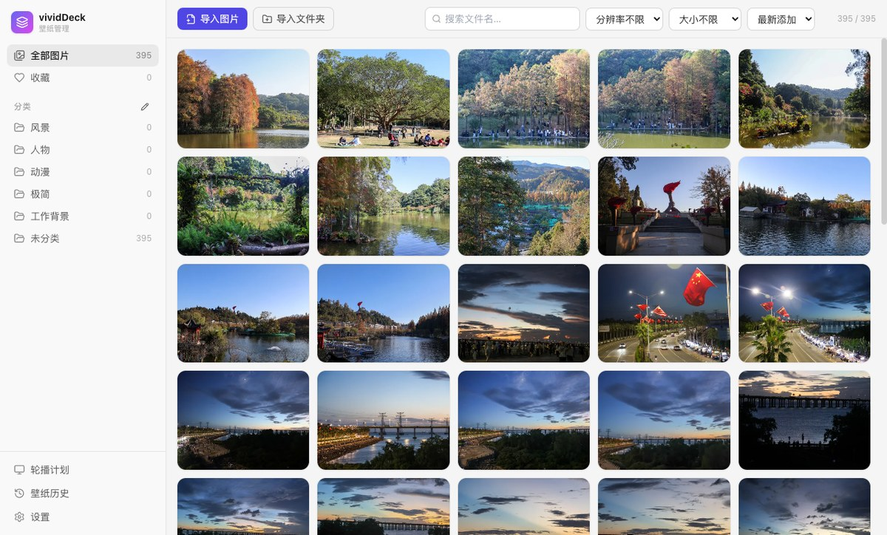
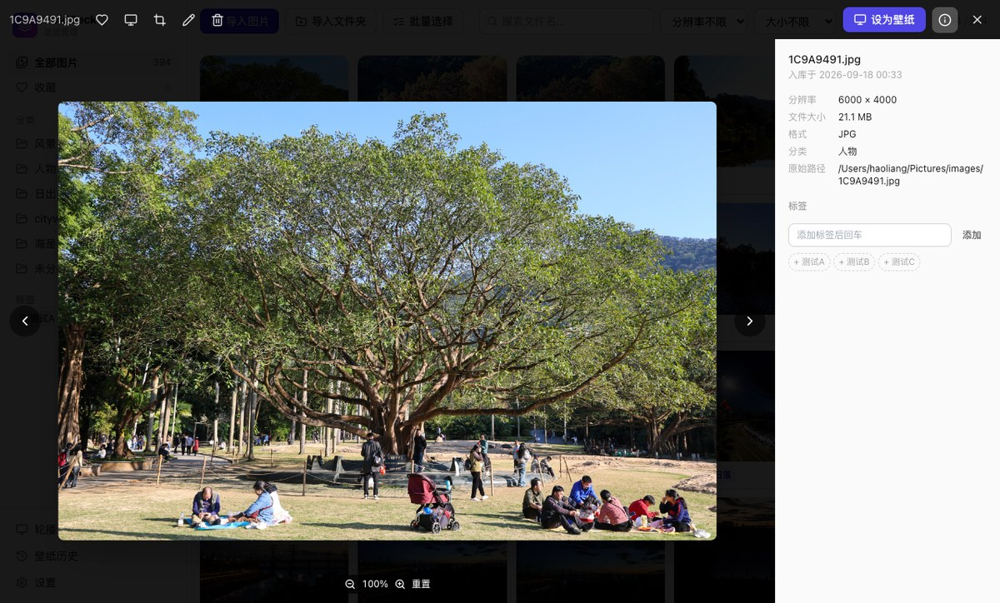
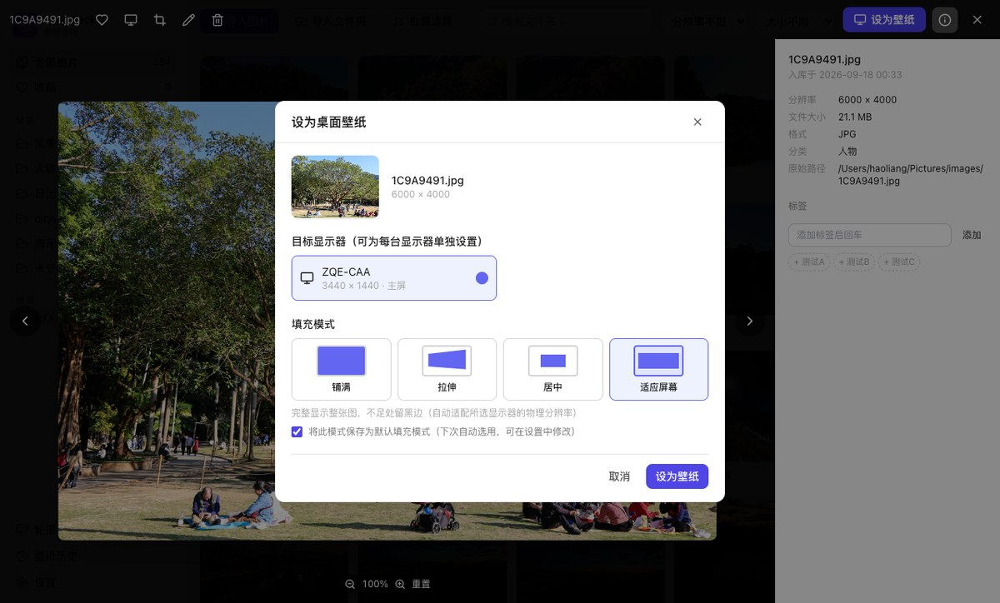
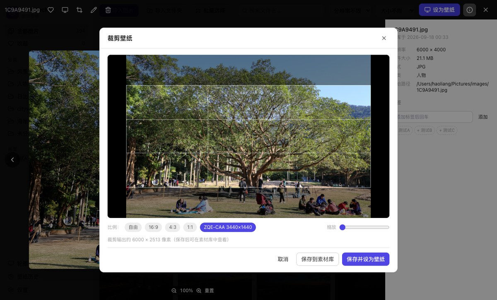
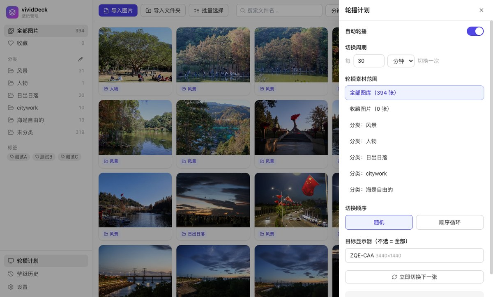
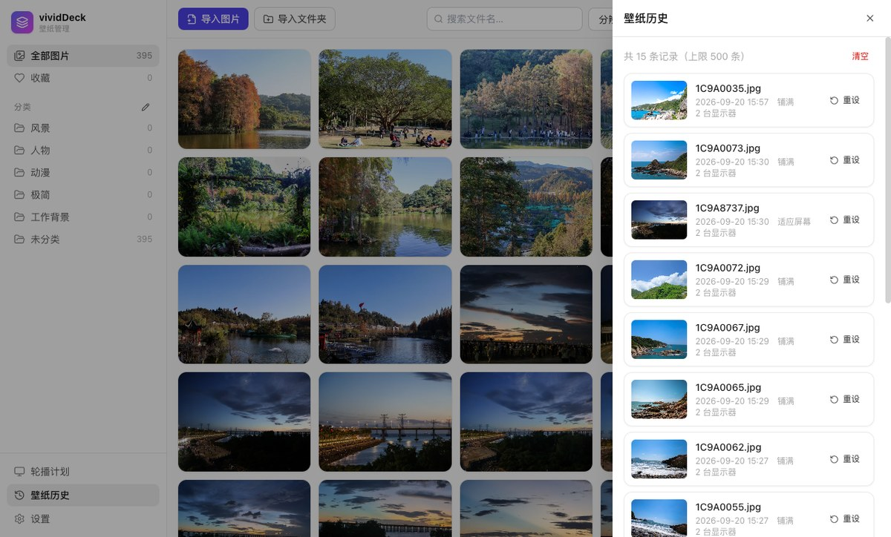
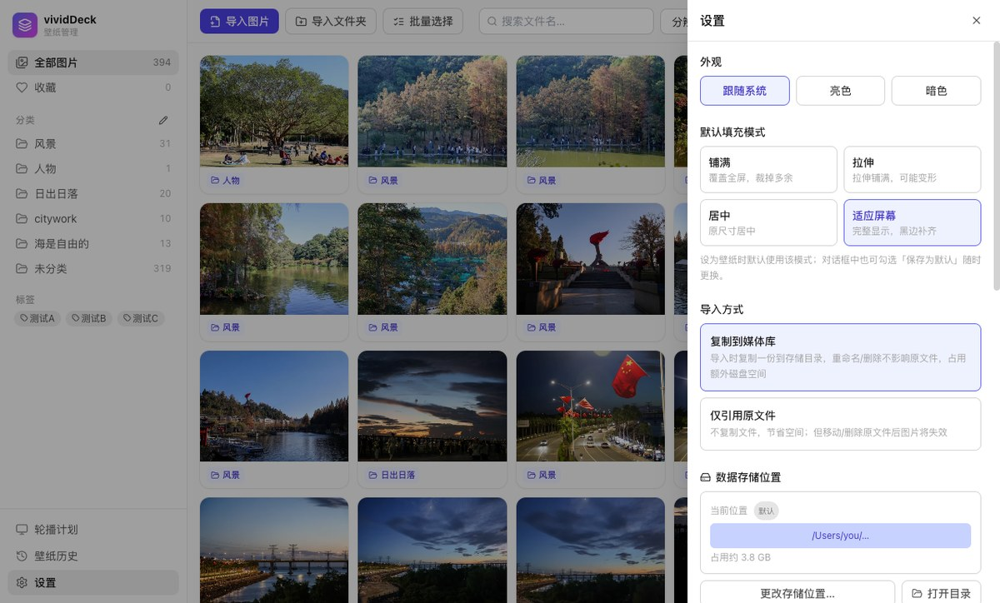

# vividDeck — 跨平台桌面壁纸管理应用

一套代码同时支持 **Windows 10/11** 与 **macOS（Ventura / Sonoma 及以上）** 的本地壁纸管理工具，数据全部本地存储、不上云。

## 功能截图

|            画廊与筛选            | 灯箱预览（缩放 / 信息面板 / 标签） |
| :------------------------------: | :--------------------------------: |
|  |   |

|    一键设壁纸（多显示器 + 填充模式）     | 壁纸裁剪（按屏幕比例 / 自由） |
| :--------------------------------------: | :---------------------------: |
|  |  |

|              轮播计划              |       壁纸历史（一键回溯）       |
| :--------------------------------: | :------------------------------: |
|  |  |

| 设置（主题 / 默认填充 / 存储位置 / MinIO 同步） |     桌面悬浮球（单击换壁纸）      |
| :---------------------------------------------: | :-------------------------------: |
|                |  |

> 截图由 `scripts/capture-screenshots.mjs` 基于真实界面自动采集，可在换新 UI 后重跑更新。

## 功能总览

### 素材库管理

- **导入**：文件 / 文件夹批量导入、窗口拖拽导入、**监视文件夹自动导入**（新图片落盘即入库，内容去重幂等，防半写文件）；支持 JPG / PNG / WebP / HEIC（内置解码，不依赖系统编解码器）；按内容哈希自动去重
- **分类 / 标签 / 收藏**：预置 5 个分类可增删改；图片卡片可拖拽到侧栏分类归类；多标签系统；一键收藏；**标签管理器**（右键标签：全库重命名 / 合并 / 删除，智能相册规则同步改写）
- **筛选检索**：分类 / 收藏 / 标签 / 分辨率（1080P·2K·4K）/ 文件大小 / 文件名关键词，多条件叠加；**筛选与排序状态重启记忆**
- **素材操作**：灯箱放大预览（滚轮缩放·平移）、**右键菜单**（设为壁纸 / 收藏 / 裁剪 / 重命名 / 删除 / 归类 / 标签）、删除可撤销、图片信息面板（分辨率·大小·格式·**拍摄时间·相机·光圈·快门·ISO·焦距**·路径·入库时间）
- **键盘操作**：方向键移动活动卡片并滚动跟随，回车开灯箱、空格收藏，Cmd/Ctrl+Z 撤销；修饰键组合不劫持（读屏软件兼容）
- **批量操作**：批量选择模式下多选 → 批量设置分类 / 批量加标签 / 批量删除 / 批量下载原图（并发 3 + 进度 + 取消 + 失败重试）
- **相似检测**：dHash 感知哈希找出"同场景多张"（连拍 / 重复截图 / 编辑版本），分组展示、深链画廊人工确认清理
- **性能**：缩略图（WebP）与预览图（JPEG）按需生成 + 磁盘缓存；零依赖虚拟滚动（数千张仅渲染可见行）；预渲染缓存 LRU 上限防无限增长

### 壁纸设置（双平台差异化适配）

- **一键设壁纸**：卡片双击 / 悬停按钮 / 右键菜单 / 灯箱按钮，四种入口
- **填充模式**：铺满 / 拉伸 / 居中 / 适应屏幕，**支持设置默认填充模式**（对话框"记住为默认"勾选 + 设置页修改），不必每次选择
- **多显示器**：识别每台显示器物理分辨率与 DPI 缩放，可为每台显示器单独设置，各自预渲染精确吻合
- **轮播计划**：分钟/小时/天周期，范围可选全部/分类/收藏/智能相册；**时段范围**（如工作时间工作壁纸、夜间照片墙，支持跨午夜）；随机（洗牌防重复）或顺序循环（进度持久化重启续播）；**多显示器独立轮播**（各屏独立的范围/周期/填充/暂停 + 池计数与空池告警，同轮跨屏去重、首切错峰）；关窗驻留系统托盘不中断
- **全局快捷键**：⌥+⌘/Ctrl+→ 下一张壁纸（应用不在前台也生效，设置页开关）
- **壁纸历史**：最近 500 条记录（含轮播切换），时间线展示，一键回溯复用
- **桌面悬浮球**：置顶圆形悬浮球显示当前壁纸缩略图，单击切换下一张、拖动换位（位置记忆·分辨率自适应）、右键菜单；托盘/设置可开关

### 智能相册

组合筛选保存为相册，画廊与轮播共用：标签交集/并集、横竖图、宽高比、分类（多选）、收藏、最小宽度、**拍摄日期范围（绝对区间 + 最近 N 天相对窗口）**、**关键词（文件名/标签包含）**、**文件大小范围**；规则实时计数预览；"存为相册"入口完整保留当前筛选条件；相册增删改经同步传播（删除有墓碑防复活）。

### 多设备同步（MinIO / S3）

- 连接自建 MinIO / S3 对象存储，多台电脑共享壁纸库：元数据（分类/标签/收藏/拍摄时间/EXIF 参数）全量双向同步
- **选择性同步**：按分类 / 智能相册圈定同步范围，控制流量与磁盘占用（手动批量下载不受限）
- 图片文件按需下载（查看/设壁纸/轮播时自动拉取并缓存），支持"全部下载/下载收藏"离线准备；缩略图全量同步保证新设备画廊秒开
- 冲突自动合并：记录级 LWW（最后修改者胜）+ 跨设备同图去重；删除以墓碑传播（相册删除同样防复活）
- **墓碑保险丝**：单次同步中"纯远端墓碑"删除超过阈值（10 条 / 10% / 200 条）自动暂停合并，需用户确认后继续——防一台被攻破设备清空全库
- **云端数据入口净化**：远端 manifest 逐记录 schema 校验（id/hash/文件名/数值），路径穿越类攻击在入口被丢弃
- 自动同步（启动 + 变更后 30s 防抖）与手动同步（设置页 / 托盘菜单）；SecretKey 经系统密钥链加密存储、日志全程脱敏

### 数据安全

- **素材库 SQLite 存储**（WAL 事务），首次启动自动从旧 JSON 迁移（原文件保留 `.migrated` 备份）
- **每周自动快照**：`VACUUM INTO` 自包含备份至 `storage/backups/`，保留最近 4 份
- 删除进本地暂存区可撤销（会话内 Cmd/Ctrl+Z 或 Toast 按钮），退出才送系统废纸篓
- **日志与崩溃兜底**：electron-log 落盘（三层脱敏）+ 主进程崩溃对话框 + 渲染层错误边界（含"重置界面偏好"逃生口）
- **自动更新**（v1.5.1 起）：Windows 全自动（后台下载 + 重启安装）；macOS 检测到新版引导跳转发布页（未签名构建的系统限制）

## 技术栈

| 层       | 技术                                                                                                                                                                             |
| -------- | -------------------------------------------------------------------------------------------------------------------------------------------------------------------------------- |
| 桌面框架 | Electron 35 + electron-vite（主进程 / preload 输出 ESM，薄 bootstrap：日志与崩溃兜底先于服务加载）                                                                               |
| 界面     | React 18 + TypeScript + Tailwind CSS + Zustand（persist 状态记忆）                                                                                                               |
| 图像处理 | sharp（HEIC 解码 / 缩略图 / 压缩 / 裁剪 / 填充模式预渲染）；exif-reader（拍摄时间与参数）                                                                                        |
| 存储     | better-sqlite3（素材库，WAL + 事务 upsert）；小型配置 JSON 原子写                                                                                                                |
| 壁纸设置 | macOS：[wallpaper](https://github.com/sindresorhus/wallpaper) 库（osascript 后备自动降级）；Windows：自研 PowerShell + `IDesktopWallpaper` COM 接口（SystemParametersInfo 兜底） |
| 对象存储 | minio-js（客户端单例 + 指数退避重试）                                                                                                                                            |
| 更新     | electron-updater（GitHub Releases）                                                                                                                                              |
| 质量工程 | Vitest（189 例纯逻辑/服务层测试）、ESLint + Prettier + husky（pre-commit 格式化、pre-push typecheck+test）、GitHub Actions CI/Release                                            |
| 打包     | electron-builder（NSIS exe / dmg，GitHub Releases 发布）                                                                                                                         |

双平台壁纸设置的差异化逻辑集中在：
`src/main/services/wallpaper/darwin.ts`（macOS）、`darwin-fallback.ts`（osascript 后备）、`win32.ts`（Windows），均以 `【系统适配 - xxx】` 注释块醒目标注。

## 环境要求

- Node.js ≥ 22（开发；better-sqlite3 v13 预编译需 Node 22 系运行时，Electron 35 内置）
- macOS 打包 dmg：需要 macOS 系统（建议 Xcode Command Line Tools）
- Windows 打包 exe：需要 Windows 10/11 系统（或直接用 CI，见下）

## 快速开始

```bash
# 安装依赖（.npmrc 已配置国内镜像）
npm install

# 生成应用/托盘图标（首次必跑）
npm run icons

# 开发模式（热更新）
npm run dev

# 类型检查 / 代码检查 / 测试
npm run typecheck
npm run lint
npm test
```

## 打包与发布

### 本地打包

```bash
# macOS：产出 dist/vividDeck-<版本>-arm64.dmg 与 -x64.dmg（在 macOS 上执行）
npm run dist:mac

# 只打当前架构（Apple Silicon）
npm run dist:mac:arm64

# Windows x64：产出 dist/vividDeck-Setup-<版本>.exe
# 推荐在 Windows 10/11 上执行；也支持在 macOS 上交叉构建（见下方说明）
npm run dist:win
```

### CI 发布（推荐）

- **push / PR**：`.github/workflows/ci.yml` 自动跑 lint / typecheck / test，并在 macOS + Windows 双平台构建安装包 artifact（Windows 包不再依赖本机交叉构建）
- **发版**：`git tag v1.5.x && git push --tags` → `.github/workflows/release.yml` 自动构建并发布到 GitHub Releases；已装用户经 electron-updater 收到更新（Windows 自动安装，macOS 引导下载）

### 在 macOS 上交叉构建 Windows exe（备用，CI 已覆盖）

sharp 的 Windows 二进制走 optionalDependencies，npm 默认不会安装跨平台包，需要手动放置一次（版本以 `node_modules/sharp/package.json` 的 optionalDependencies 为准）：

```bash
cd node_modules/@img
npm pack @img/sharp-win32-x64@0.33.5          # 版本对齐 sharp 的 optionalDependencies
mkdir -p sharp-win32-x64
tar -xzf img-sharp-win32-x64-0.33.5.tgz -C sharp-win32-x64 --strip-components=1
rm -f img-sharp-win32-x64-*.tgz
cd ../..
npm run dist:win
```

（`@img/sharp-win32-x64` 0.33.x 的 tarball 内已捆绑 libvips DLL，无需另装 libvips 包。）

## 目录结构

```
src/
├── main/                  # Electron 主进程（薄 bootstrap：logger 先行，服务延迟加载）
│   ├── index.ts           # 窗口 / 托盘 / media:// 协议 / 单实例 / 存储校验
│   ├── ipc.ts             # IPC handler 注册（类型来自 shared/ipcContract 单一事实来源）
│   ├── media.ts           # media:// 协议解析（按需生成缩略图/预览）
│   └── services/
│       ├── paths.ts       # 存储路径集中管理（含旧布局迁移 / 自定义目录 / 记忆化）
│       ├── db.ts          # SQLite 素材库存储（WAL / 迁移 / 周快照）
│       ├── library.ts     # 素材库（导入/分类/标签/收藏/删除/裁剪/EXIF 回填）
│       ├── thumbnails.ts  # sharp 缩略图与预览图缓存
│       ├── slideshow.ts   # 轮播调度器（指数退避 / 屏幕热插拔 / 时段范围 / 跨屏去重）
│       ├── watcher.ts     # 文件夹监视自动导入
│       ├── similar.ts     # dHash 相似检测（内容哈希键控缓存）
│       ├── cache.ts       # 缓存清理（白名单式孤儿识别）
│       ├── shortcuts.ts   # 全局快捷键
│       ├── updater.ts     # electron-updater（Win 全自动 / mac 引导下载）
│       ├── logger.ts      # electron-log 落盘 + 脱敏 + 崩溃兜底
│       ├── history.ts     # 壁纸历史
│       ├── wallpaper/     # 壁纸适配层（双平台差异化核心）
│       ├── workers/       # worker 线程池（并行 sha1 校验）
│       └── sync/          # MinIO 同步（client 单例+重试 / merge CRDT / engine / validate 入口净化）
├── preload/               # contextBridge 安全 API（按契约泛型调用）
├── renderer/              # React 界面
│   └── src/
│       ├── components/    # 画廊（gallery/ 拆分）/ 灯箱 / 侧栏 / 轮播面板 / 设置
│       ├── hooks/         # 键盘导航等
│       ├── lib/           # 虚拟滚动数学 / 偏好持久化清洗
│       └── store/         # Zustand（引用稳定的选择器缓存）
├── shared/                # 主/渲染共享：类型 / IPC 契约 / 相册匹配 / 时段解析 / dHash / 标签操作
tests/                     # Vitest（189 例：合并/相册/健康检查/重试/哈希池/DB/偏好/虚拟滚动…）
.github/workflows/         # CI（双平台构建）与 Release（tag 发布）
scripts/                   # 图标生成 / 冒烟 / CDP e2e / 本地 S3 / 双设备同步验证
```

## 数据存储（全部本地）

默认位于 `系统用户数据目录/vividDeck/storage/`（可在 设置 → 数据存储位置 更改，支持整体迁移到其他磁盘）：

```
storage/
├── data/        素材库（library.db，SQLite WAL）与设置（JSON）
├── library/     复制入库的媒体文件
├── thumbnails/  缩略图缓存（WebP）
├── previews/    预览图缓存（JPEG，按需生成）
├── applied/     填充模式预渲染缓存（LRU 上限 120 份）
├── backups/     素材库周快照（保留 4 份，VACUUM INTO 自包含）
└── bin/         Windows PowerShell 脚本
```

说明：素材库采用 **SQLite（WAL + 单事务 upsert）**，崩溃安全且只写变更行；旧版 `library.json` 首次启动自动迁移（原文件保留为 `.migrated`）。小型配置类数据仍用原子写 JSON（可直接查看备份）。更换存储目录采用"先复制后切换"，中断不丢数据；外置盘未挂载时启动有保护提示。

## 文档

- [docs/使用说明.md](docs/使用说明.md) —— 功能操作、系统权限说明、轮播使用方法、常见问题
- [待开发功能清单.md](待开发功能清单.md) —— 功能路线图与实现记录（含历次代码审查修复）
